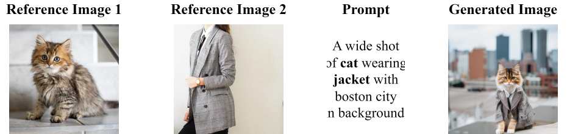

## <div align="center"> Resolving Multi-Condition Confusion for Finetuning-Free Personalized Image Generation </div>

<div align="center">

  <a href="https://arxiv.org/abs/2409.17920"></a> &ensp;
  <a href="https://huggingface.co/datasets/hqhQAQ/subject_dataset_10k/tree/main"></a> &ensp;
  <a href="https://huggingface.co/hqhQAQ/MIP-Adapter/tree/main"></a> &ensp;

</div>

### Overview

This is the official implementation of paper "Resolving Multi-Condition Confusion for Fine-tuning-free Personalized Image Generation" [[arXiv](https://arxiv.org/abs/2409.17920)], which generalizes finetuning-free pre-trained model (IP-Adapter) to **simultaneous merge multiple reference images**.

Notably, our model can achieve state-of-the-art performance on **Multi-Object Personalized Image Generation** with **only 5 hours** of training time on 8 GPUs.

### Introduction

Personalized text-to-image generation methods can generate customized images based on the reference images, which have garnered wide research interest.
Recent methods propose a finetuning-free approach with a decoupled cross-attention mechanism to generate personalized images requiring no test-time finetuning.
However, when multiple reference images are provided, the current decoupled cross-attention mechanism encounters the *object confusion* problem and fails to map each reference image to its corresponding object, thereby seriously limiting its scope of application.
To address the object confusion problem, in this work we investigate the relevance of different positions of the latent image features to the target object in diffusion model, and accordingly propose a weighted-merge method to merge multiple reference image features into the corresponding objects.
Next, we integrate this weighted-merge method into existing pre-trained models and continue to train the model on a multi-object dataset constructed from the open-sourced SA-1B dataset.
To mitigate object confusion and reduce training costs, we propose an *object quality score* to estimate the image quality for the selection of high-quality training samples.
The framework of our method is shown as below:


### Performance

* **Table 1:** Performance comparisons on *Concept101* ('FT' denotes finetuning-based method, 'no-FT' denotes finetuning-free method, and bold font denotes the best result):

  | Method | Type | CLIP-T | CLIP-I | DINO |
  | --- | :---: | --- | --- | --- |
  | DreamBooth | FT | 0.7383 | 0.6636 | 0.3849 |
  | Custom Diffusion (Opt) | FT | 0.7599 | 0.6595 | 0.3684
  | Custom Diffusion (Joint) | FT |  0.7534 | 0.6704 | 0.3799
  | Mix-of-Show | FT | 0.7280 | 0.6700 | 0.3940
  | MC^2 | FT | 0.7670 | 0.6860 | 0.4060
  | FastComposer |  no-FT | 0.7456 | 0.6552 | 0.3574
  | $\lambda$-ECLIPSE | no-FT | 0.7275 | 0.6902 | 0.3902
  | ELITE | no-FT | 0.6814 | 0.6460 | 0.3347
  | IP-Adapter | no-FT | 0.6343 | 0.6409 | 0.3481
  | SSR-Encoder | no-FT | 0.7363 | 0.6895 | 0.3970
  | **Ours (sdxl)** [Small dataset (10k images)] | no-FT | 0.7694 | **0.6967** | 0.4108
  | **Ours (sdxl)** [Original dataset] | no-FT | 0.7750 | 0.6943 | 0.4127
  | **Ours (sdxl_plus)** [Small dataset (10k images)] | no-FT | 0.7752 | 0.6924 | 0.4375
  | **Ours (sdxl_plus)** [Original dataset] | no-FT | **0.7765** | 0.6950 | **0.4397**

### Todo List

- [x] Paper
- [x] Dataset
- [x] Model weights
- [x] Training code
- [x] Inference code
- [x] Evaluation code

### Requirements

The python packages required for this project is listed as below:

```
torch==1.13.1
torchvision==0.14.1
diffusers==0.23.1
einops
modelscope
numpy==1.24.4
oss2
Pillow==10.1.0
PyYAML
safetensors
tqdm
imgviz
transformers==4.35.2
tensorboard
accelerate
opencv-python
imgviz
openai-clip
scikit-learn
setuptools==69.5.1
```

### Dataset

* **Train dataset.** Due to the company's strict open source audit system, we can only release part (10k images) of the original training dataset. Nevertheless, the model trained with this small dataset can still achieve the **SOTA performance** (Please refer to Table 1 for more details).

  Download `subject_dataset_10k.zip` from [Hugging Face](https://huggingface.co/datasets/hqhQAQ/subject_dataset_10k/tree/main). This dataset is constructed from the opensourced SA-1B dataset. Unzip `subject_dataset_10k.zip` to `/PATH/TO/subject_dataset_10k/`. The file structure of this folder is as below:

  ```
  --subject_dataset_10k
    |--images
    |--jsons
    |--masks
  ```

* **Test dataset.** We conduct quantitative comparisons of our method with other methods on the [Concept101 dataset](https://github.com/adobe-research/custom-diffusion/tree/main/customconcept101), which is proposed by Custom Diffusion.

  Prepare this dataset in two steps:

  * First, download the `prompts` folder and `dataset_multiconcept.json` file from [Concept101 dataset](https://github.com/adobe-research/custom-diffusion/tree/main/customconcept101) and place them in `customconcept101/`. (We have downloaded these files in `customconcept101` of this project, and you can directly skip to the next step.)
  
  * Next, download the images `benchmark_dataset.zip` from the [Google Drive url](https://drive.usercontent.google.com/download?id=1jj8JMtIS5-8vRtNtZ2x8isieWH9yetuK&authuser=0) provided in [Concept101 dataset](https://github.com/adobe-research/custom-diffusion/tree/main/customconcept101), and unzip `benchmark_dataset.zip` to `customconcept101/benchmark_dataset/`.

  Finally, the file structure of `customconcept101/` is as below:

  ```
  --customconcept101
    |--benchmark_dataset
    |--json_data
    |--prompts
    |--dataset_multiconcept.json
  ```

### Pre-trained models

* **Base models.** Our MIP-Adapter can be trained from two variants of IP-Adapter, which are for `sdxl` model and `sdxl_plus` model respectively. You can choose *one of these two models* for training and inference. The pre-trained weights of `sdxl` model and `sdxl_plus` model can be downloaded from:

  * `sdxl`: [stabilityai/stable-diffusion-xl-base-1.0](https://huggingface.co/stabilityai/stable-diffusion-xl-base-1.0)

  * `sdxl_plus`: [SG161222/RealVisXL_V1.0](https://huggingface.co/SG161222/RealVisXL_V1.0)

* **Training.** The original IP-Adapter is required for training MIP-Adapter:

  * [h94/IP-Adapter](https://huggingface.co/h94/IP-Adapter)

* **Inference and evaluation.** Our trained MIP-Adapter can be downloaded from:

  * [hqhQAQ/MIP-Adapter](https://huggingface.co/hqhQAQ/MIP-Adapter)

The path of these models will be `/PATH/TO/stable-diffusion-xl-base-1.0/`, `/PATH/TO/RealVisXL_V1.0/`, `/PATH/TO/IP-Adapter/`, and `/PATH/TO/MIP-Adapter/` respectively.

### Training

* Train MIP-Adapter based on `sdxl` model:

  Run the following script for training our model based on `sdxl` model (note that `/PATH/TO` in `--pretrained_model_name_or_path`, `--pretrained_ip_adapter_path`, `--image_encoder_path`, and `--data_root` should be changed to your own path, and 8 GPUs are used here).

  ```
  accelerate launch --num_processes 8 --multi_gpu --mixed_precision "fp16" train_sdxl.py \
    --pretrained_model_name_or_path /PATH/TO/stable-diffusion-xl-base-1.0/ \
    --pretrained_ip_adapter_path /PATH/TO/IP-Adapter/sdxl_models/ip-adapter_sdxl.bin \
    --image_encoder_path /PATH/TO/IP-Adapter/sdxl_models/image_encoder/ \
    --data_root /PATH/TO/subject_dataset_10k/ \
    --data_pkl_file configs/selected_indexes_sam_10k.pkl \
    --eval_data_root customconcept101/ \
    --mixed_precision fp16 \
    --resolution 512 \
    --train_batch_size 4 \
    --dataloader_num_workers 4 \
    --learning_rate 1e-04 \
    --weight_decay 0.01 \
    --save_steps 12000 \
    --stop_step 12000 \
    --output_dir output/exp_sdxl/ \
    --infer_scale 0.75
  ```

* Train MIP-Adapter based on `sdxl_plus` model:

  Run the following script for training our model based on `sdxl_plus` model (note that `/PATH/TO` in `--pretrained_model_name_or_path`, `--pretrained_ip_adapter_path`, `--image_encoder_path`, and `--data_root` should be changed to your own path, and 8 GPUs are used here).

  ```
  accelerate launch --num_processes 8 --multi_gpu --mixed_precision "fp16" train_sdxl_plus.py \
    --pretrained_model_name_or_path /PATH/TO/RealVisXL_V1.0/ \
    --pretrained_ip_adapter_path /PATH/TO/IP-Adapter/sdxl_models/ip-adapter-plus_sdxl_vit-h.bin \
    --image_encoder_path /PATH/TO/IP-Adapter/models/image_encoder/ \
    --data_root /PATH/TO/subject_dataset_10k/ \
    --data_pkl_file configs/selected_indexes_sam_10k.pkl \
    --eval_data_root customconcept101/ \
    --mixed_precision fp16 \
    --resolution 512 \
    --train_batch_size 4 \
    --dataloader_num_workers 4 \
    --learning_rate 1e-04 \
    --weight_decay 0.01 \
    --save_steps 12000 \
    --stop_step 12000 \
    --output_dir output/exp_sdxl_plus/ \
    --infer_scale 0.65
  ```

### Inference

* Inference based on `sdxl` model:

  Run the following script for multi-object personalized image generation using MIP-Adapter based on `sdxl` model. Note that `--reference_image1_path` and `--reference_image2_path` specify the paths of the reference images, and `--prompt` specifies the text prompt.
  Besides, `/PATH/TO` should be changed to your own path, and `/PATH/TO/MIP-Adapter/model_sdxl.bin` is the checkpoint path of the trained model.

  ```
  python inference.py \
      --base_model_path /PATH/TO/stable-diffusion-xl-base-1.0/ \
      --image_encoder_path /PATH/TO/IP-Adapter/sdxl_models/image_encoder/ \
      --ip_ckpt /PATH/TO/MIP-Adapter/model_sdxl.bin \
      --scale 0.75 \
      --reference_image1_path assets/combination_1/cat.jpg \
      --reference_image2_path assets/combination_1/jacket.jpg \
      --prompt "A wide shot of cat wearing jacket with boston city in background." \
      --num_samples 1 \
      --output_dir output/vis_sdxl/ \
      --is_plus False
  ```

  Three samples are provided in this repository in the `assets` folder.

  * Combination 1

    ```
    --reference_image1_path assets/combination_1/cat.jpg
    --reference_image2_path assets/combination_1/jacket.jpg
    --prompt "A wide shot of cat wearing jacket with boston city in background."
    ```

  * Combination 2
    
    ```
    --reference_image1_path assets/combination_2/cat.jpg
    --reference_image2_path assets/combination_2/dice.jpg
    --prompt "A pet cat playing with dice on a sidewalk."
    ```

  * Combination 3

    ```
    --reference_image1_path assets/combination_3/barn.jpg
    --reference_image2_path assets/combination_3/dog.jpg
    --prompt "Dog in front of barn in snowy ice."
    ```

* Inference based on `sdxl_plus` model:

  Likewise, run the following script for multi-object personalized image generation using MIP-Adapter based on `sdxl_plus` model.

  ```
  python inference.py \
      --base_model_path /PATH/TO/RealVisXL_V1.0/ \
      --image_encoder_path /PATH/TO/IP-Adapter/models/image_encoder/ \
      --ip_ckpt /PATH/TO/MIP-Adapter/model_sdxl_plus.bin \
      --scale 0.65 \
      --reference_image1_path assets/combination_1/cat.jpg \
      --reference_image2_path assets/combination_1/jacket.jpg \
      --prompt "A wide shot of cat wearing jacket with boston city in background." \
      --num_samples 1 \
      --output_dir output/vis_sdxl_plus/ \
      --is_plus True
  ```

* Visualizations:

  

### Quantitative Evaluation

* Inference based on `sdxl` model:

  Run the following script to qutitatively evaluate the trained model (using three metrics: CLIP-T score, CLIP-I score, DINO score) on the Concept101 dataset.
  Besides, `/PATH/TO` should be changed to your own path, and `/PATH/TO/MIP-Adapter/model_sdxl.bin` is the checkpoint path of the trained model.

  ```
  python inference_concept101.py \
      --base_model_path /PATH/TO/stable-diffusion-xl-base-1.0/ \
      --image_encoder_path /PATH/TO/IP-Adapter/sdxl_models/image_encoder/ \
      --ip_ckpt /PATH/TO/MIP-Adapter/model_sdxl.bin \
      --data_root customconcept101/ \
      --scale 0.75 \
      --output_dir output/vis_concept101_sdxl/ \
      --is_plus False
  ```

* Inference based on `sdxl_plus` model:

  Likewise, run the following script to qutitatively evaluate the trained model (using three metrics: CLIP-T score, CLIP-I score, DINO score) on the Concept101 dataset.

  ```
  python inference_concept101.py \
      --base_model_path /PATH/TO/RealVisXL_V1.0/ \
      --image_encoder_path /PATH/TO/IP-Adapter/models/image_encoder/ \
      --ip_ckpt /PATH/TO/MIP-Adapter/model_sdxl_plus.bin \
      --data_root customconcept101/ \
      --scale 0.65 \
      --output_dir output/vis_concept101_sdxl_plus/ \
      --is_plus True
  ```

The quantitative evaluation results are demonstrated in Table 1.